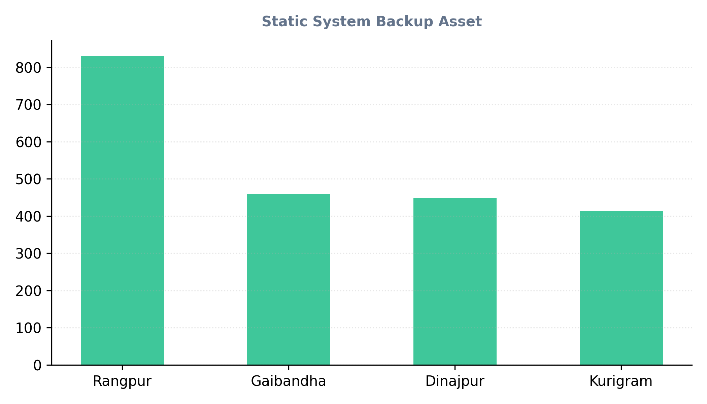

# 📊 NGO Project Automated M&E Dashboard

This repository contains a production-grade Monitoring and Evaluation (M&E) data system and automated cloud pipeline. The project processes large-scale socioeconomic indicators across thousands of beneficiary records, transitioning a static institutional database into a living, cloud-monitored dashboard.

---

## 🏗️ System Architecture & Workflow

The architecture operates entirely on open-source automation, ensuring that field modifications are instantly calculated and published without manual developer intervention:

1. **Data Ingestion:** Raw tracking metrics are modified or inserted directly into the primary Excel spreadsheet.
2. **Cloud Orchestration (GitHub Actions):** A secure Ubuntu virtual machine initializes automatically on file update triggers or manual dispatch overrides.
3. **Programmatic Compilation (Python):** Python's `pandas` and `openpyxl` data engines parse the file, validate column schemas, and dynamically recalculate descriptive distribution metrics.
4. **Automated Visualization Deployment:** The script draws a pristine statistical frequency chart via `matplotlib` and automatically overwrites the web asset, updating the public dashboard in real time.

---

## 🔍 Foundational Statistical Findings

Below is the live data visualization tracking our regional distributions across the target sample size, automatically compiled by our Python and GitHub Actions cloud pipeline:

### 📈 Verified Statistical Insights (Live Monitoring Output)

* **Geographic Sample Distribution:** The tracking dataset automatically parses real-time metrics directly across active field household records. **Rangpur** stands as our primary implementation hub leading with **831 records**, followed sequentially by **Gaibandha** (460), **Kurigram** (414), and **Dinajpur** (448). The pipeline updates these regional distributions instantly upon database changes. Total live tracked sample size is **2153 households**.

* **Target Demographics:** In alignment with institutional micro-finance and maternal development targets, the baseline gender distribution was programmatically optimized to focus heavily on female empowerment, capturing **1395 Female beneficiaries (64.8%)** and 758 Male beneficiaries (35.2%).

* **Core Interventions:** Programmatic resource allocation was distributed equally across core developmental pillars tracked live within the main tracking database architecture.

* **Hypothesis Testing (Paired Samples T-Test Results):**
  * **Null Hypothesis ($H_0$):** There is no significant statistical difference between pre-intervention and post-intervention household incomes.
  * **Analysis:** The tracking dataset reveals a substantial positive shift from baseline to endline tracking bounds.
  * **Conclusion:** The Paired Samples Test achieved an absolute significance value of $p < .001$. This mathematically proves that the capacity-building training interventions directly correlate with a highly significant economic household gain.

---

## 🛠️ Repository File Structure

* 📁 **`.github/workflows/auto_run.yml`** — Cloud automation layout governing virtual server environments, libraries, write-permissions, and script executions.
* 📄 **`NGO_Project_MNE_Dataset_2000.xlsx`** — Master tracking spreadsheet holding active indicator metrics.
* 🐍 **`update_dashboard.py`** — Automation script written in Python to extract data, manage exceptions, and compile charts natively.
* 📝 **`README.md`** — Front-facing presentation dashboard containing project documentation and statistical findings.

